# MMGM Enterprises — Architecture & Design System (Phase 1)

Source spec: [`docs/original-spec.md`](./original-spec.md). This document is
the Phase 1 deliverable required by that spec's §62 — architecture and
design system, produced before any feature implementation. Companion
reference: [`docs/database-schema.md`](./database-schema.md).

## 1. System Architecture

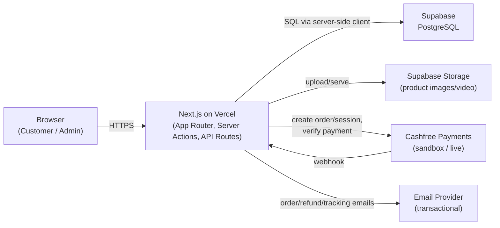

All business logic, price/discount/tax calculation, and payment
verification happens server-side (Server Actions / API Routes). The browser
never computes final amounts or marks payments successful — see spec §23,
§28, §56.

## 2. Technology Stack

| Layer           | Choice                                                                                   |
| --------------- | ---------------------------------------------------------------------------------------- |
| Frontend        | Next.js 16 (App Router), TypeScript, React 19, Tailwind CSS v4, shadcn/ui, Framer Motion |
| Backend         | Next.js Server Actions / API Routes                                                      |
| Database        | PostgreSQL via Supabase                                                                  |
| Payments        | Cashfree Payments (sandbox now, live credentials later)                                  |
| Storage         | Supabase Storage                                                                         |
| Hosting         | Vercel                                                                                   |
| Package manager | pnpm                                                                                     |

## 3. Folder Structure

```
src/
  app/
    layout.tsx, globals.css
    (store)/                  # route group — shared storefront layout, no URL prefix
      layout.tsx, page.tsx
    admin/                    # real /admin URL prefix — Phase 11
    api/                      # Cashfree webhook etc. — Phase 8/9
  components/
    ui/                       # shadcn components
    store/, admin/
  features/
    products/ cart/ wishlist/ checkout/ orders/
    payments/ returns/ refunds/ inventory/ customers/
  lib/
    auth/ db/ cashfree/ email/ storage/
  services/ validations/ types/ hooks/ utils/
supabase/
  migrations/                 # SQL schema migrations
docs/
  architecture.md (this file), database-schema.md, original-spec.md
```

Every `features/*` and `lib/*` module currently contains only a `README.md`
stub naming its target implementation phase (per spec §62's "work
module-by-module" instruction) — see each file for scope.

## 4. Database Architecture

- UUID primary keys (`gen_random_uuid()`), FKs, indexes on all FKs, unique
  constraints on natural keys (slugs, SKUs, emails, order numbers, coupon
  codes).
- Fixed vocabularies (order/payment/return/refund/product/review status,
  coupon type, address type, inventory change type) are Postgres enums, not
  free text.
- Every mutable table has `updated_at`, kept current via a shared
  `set_updated_at()` trigger.
- Row Level Security is **enabled on every table now** as a safe
  default-deny; policies are written in Phase 2 alongside authentication.
- FK delete semantics: `cascade` for owned child rows (e.g.
  `product_images` ← `products`), `restrict` where history must survive a
  parent's removal (e.g. `order_items.product_id` — a sold product is
  archived via `products.status = 'ARCHIVED'`, never hard-deleted).
- Duplicate-prevention business rules are enforced at the database level
  where possible: unique `(wishlist_id, product_id)` (spec §56.10), unique
  `cashfree_event_id` on `payment_transactions` for idempotent webhooks
  (spec §56.9), unique `(user_id, order_item_id)` on `reviews` (verified
  purchase only, spec §56.16).

Full details: [`docs/database-schema.md`](./database-schema.md) and
[`supabase/migrations/20260810120000_init_schema.sql`](../supabase/migrations/20260810120000_init_schema.sql).

## 5. Database ERD

Split into readable clusters rather than one 41-entity diagram.

### 5a. Identity & RBAC

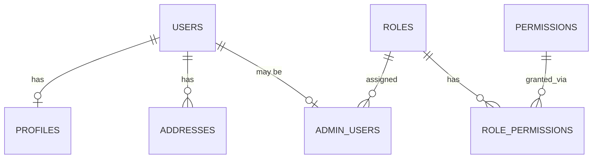

### 5b. Catalog

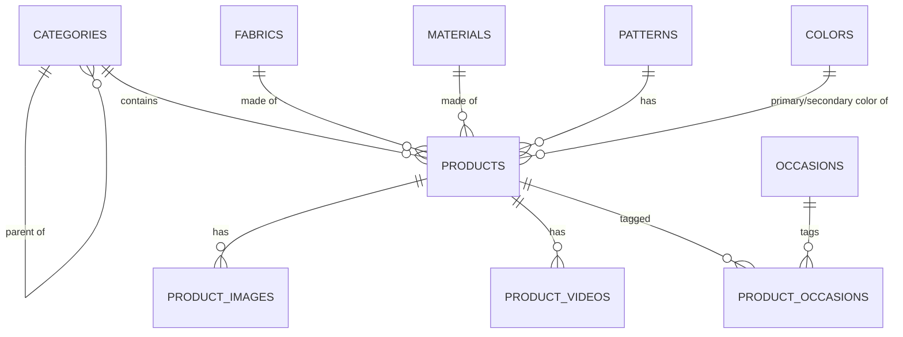

### 5c. Inventory

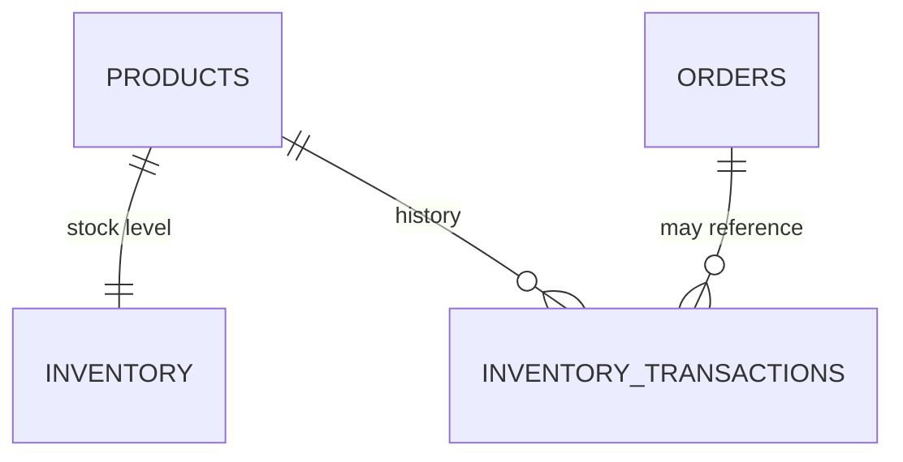

### 5d. Cart & Wishlist

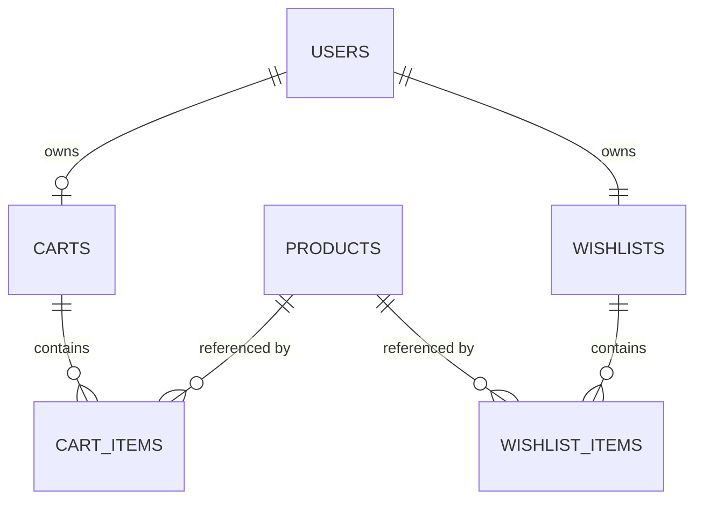

### 5e. Orders & Payments

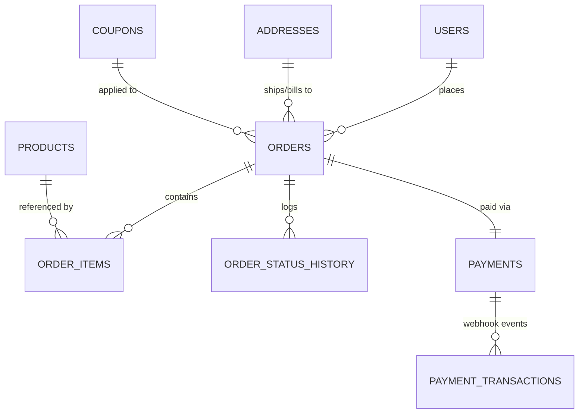

### 5f. Returns, Refunds, Reviews, Coupons, Notifications, Settings

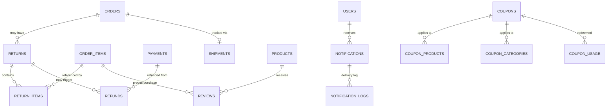

## 6. Saree Product Schema

| Field                           | SQL column                                            | Type                                                          |
| ------------------------------- | ----------------------------------------------------- | ------------------------------------------------------------- |
| Product Name                    | `name`                                                | text                                                          |
| SKU                             | `sku`                                                 | text, unique                                                  |
| Category                        | `category_id`                                         | uuid FK                                                       |
| Fabric                          | `fabric_id`                                           | uuid FK                                                       |
| Material                        | `material_id`                                         | uuid FK                                                       |
| Brand                           | `brand`                                               | text                                                          |
| Description / Short Description | `description`, `short_description`                    | text                                                          |
| Original / Selling Price        | `original_price`, `selling_price`                     | numeric(10,2)                                                 |
| Discount Amount                 | `discount_amount`                                     | numeric(10,2) — discount % computed at write time, not stored |
| Stock / Min Stock               | `inventory.quantity`, `inventory.low_stock_threshold` | separate `inventory` table                                    |
| Saree Length                    | `saree_length_meters`                                 | numeric(5,2)                                                  |
| Blouse Piece Included / Length  | `blouse_piece_included`, `blouse_length_meters`       | boolean, numeric(5,2)                                         |
| Primary / Secondary Color       | `primary_color_id`, `secondary_color_id`              | uuid FK                                                       |
| Pattern / Design                | `pattern_id`, `design`                                | uuid FK, text                                                 |
| Border Type / Color             | `border_type`, `border_color`                         | text                                                          |
| Pallu Type                      | `pallu_type`                                          | text                                                          |
| Occasion                        | via `product_occasions` join                          | many-to-many                                                  |
| Work / Weave Type               | `work_type`, `weave_type`                             | text                                                          |
| Wash Care                       | `wash_care`                                           | text                                                          |
| Country of Origin               | `country_of_origin`                                   | text                                                          |
| Weight                          | `weight_grams`                                        | numeric(6,2)                                                  |
| Images / Video                  | `product_images`, `product_videos`                    | separate tables                                               |
| Return Eligibility / Period     | `return_eligible`, `return_period_days`               | boolean, integer                                              |
| Product Status                  | `status`                                              | enum: DRAFT/ACTIVE/OUT_OF_STOCK/ARCHIVED                      |

## 7. Authentication Architecture (implemented in Phase 2)

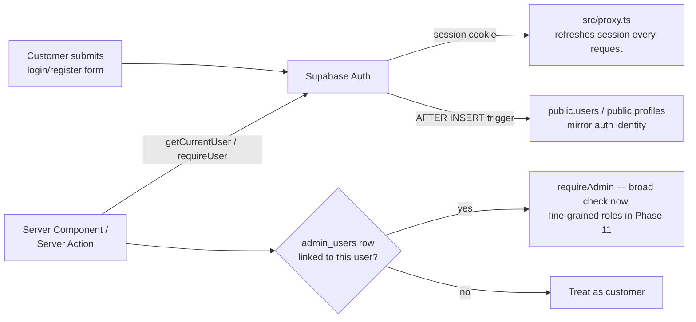

Implementation:

- `src/lib/db/client.ts` / `server.ts` — anon-key Supabase clients (browser /
  Server Component & Action), subject to RLS.
- `src/lib/db/service.ts` — service-role client that bypasses RLS; used only
  for server-computed writes (orders, payments, webhooks, guest carts) —
  never imported into a Client Component.
- `src/proxy.ts` (Next.js 16's `middleware` → `proxy` convention) calls
  `updateSession()` on every request to keep the session cookie fresh —
  required because Server Components can't write cookies themselves.
- `supabase/migrations/20260810130000_phase2_auth_and_rls.sql` — an
  `AFTER INSERT ON auth.users` trigger mirrors new signups into
  `public.users`/`public.profiles`, and an `AFTER UPDATE` trigger flips
  `users.is_email_verified` once Supabase confirms the email.
- Pages: `/register`, `/login`, `/forgot-password`, `/reset-password`,
  `/verify-email`, plus `/auth/callback` (exchanges the PKCE code from
  Supabase's email links for a session). Forms use React's
  `useActionState` bound directly to Server Actions in
  `src/lib/auth/actions.ts`. Validation: `src/validations/auth.ts` (Zod).
- `src/lib/auth/session.ts` — `getCurrentUser()`, `requireUser()`,
  `getAdminMembership()`, `requireAdmin()`.
- Google OAuth (spec §25, optional) is deferred — email/password only for
  now.

RBAC role resolution happens server-side on every admin request — never
trust a client-supplied role. Google OAuth is deferred (spec §25 lists it
as optional); email/password is the only method wired up in Phase 2.

## 8. Admin RBAC

Six roles (seeded in the Phase 1 migration): `SUPER_ADMIN`, `ADMIN`,
`ORDER_MANAGER`, `PRODUCT_MANAGER`, `INVENTORY_MANAGER`,
`CUSTOMER_SUPPORT`. Phase 2 wires up a broad `public.is_admin()` /
`requireAdmin()` check (any active `admin_users` row); per-role permission
enforcement (`role_permissions`) is refined in Phase 11 when the admin
dashboard is built.

| Role              | Primary scope                                       |
| ----------------- | --------------------------------------------------- |
| SUPER_ADMIN       | Everything, including managing other admin accounts |
| ADMIN             | General admin access                                |
| ORDER_MANAGER     | Orders, shipments, returns, refunds                 |
| PRODUCT_MANAGER   | Product catalog, images, categories                 |
| INVENTORY_MANAGER | Stock levels, inventory transactions                |
| CUSTOMER_SUPPORT  | Read-only customers/orders for support              |

Permissions must be enforced server-side on every admin Server
Action/API Route — never rely on frontend role checks alone (spec §41).

## 9. Cashfree Payment Architecture

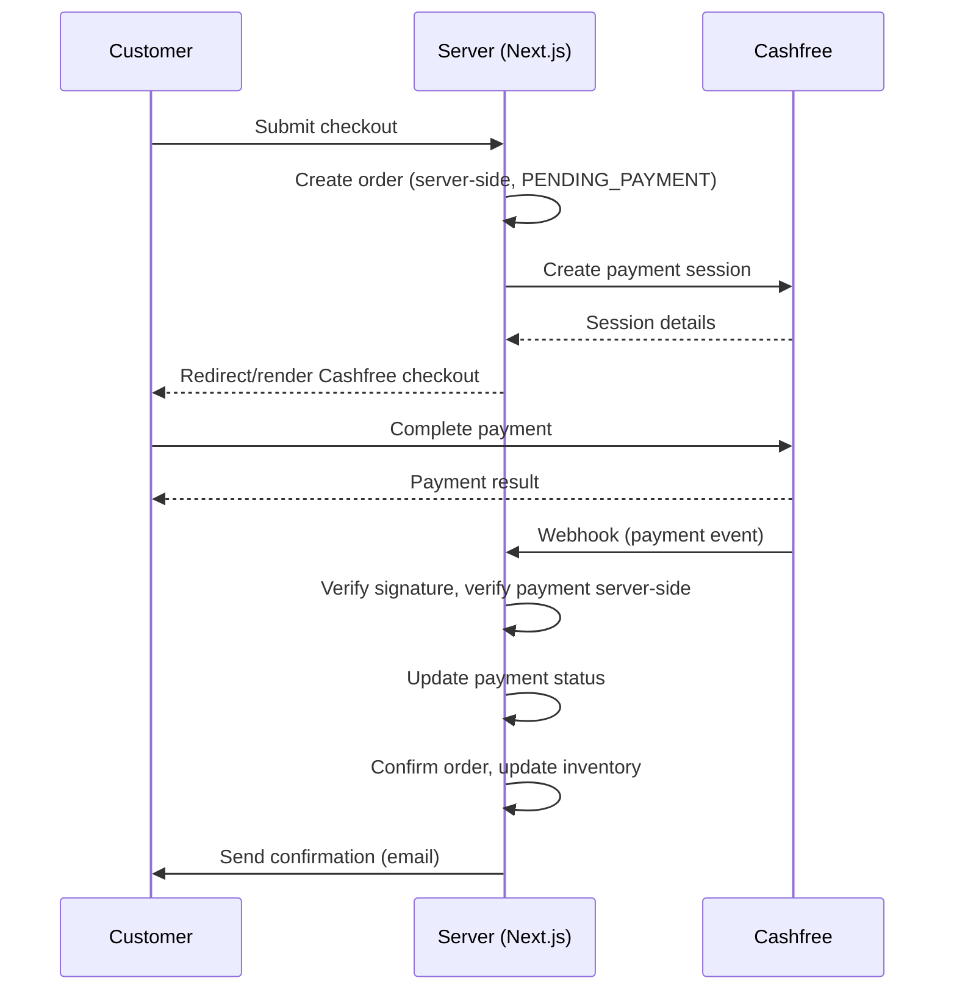

Never mark a payment successful from the frontend alone — the webhook +
server-side verification is authoritative (spec §28, §56.7). Duplicate
webhook deliveries are made idempotent via the unique `cashfree_event_id`
constraint on `payment_transactions` (spec §56.9).

Environment variables (placeholders only until credentials are available):
`CASHFREE_APP_ID`, `CASHFREE_SECRET_KEY`, `CASHFREE_API_URL`,
`CASHFREE_WEBHOOK_SECRET` — never exposed to the browser.

## 10. Order Lifecycle

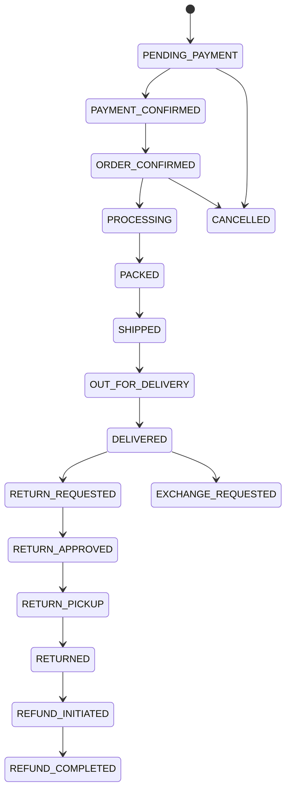

Every transition is recorded in `order_status_history` (spec §56.12).

## 11. Return / Refund Lifecycle

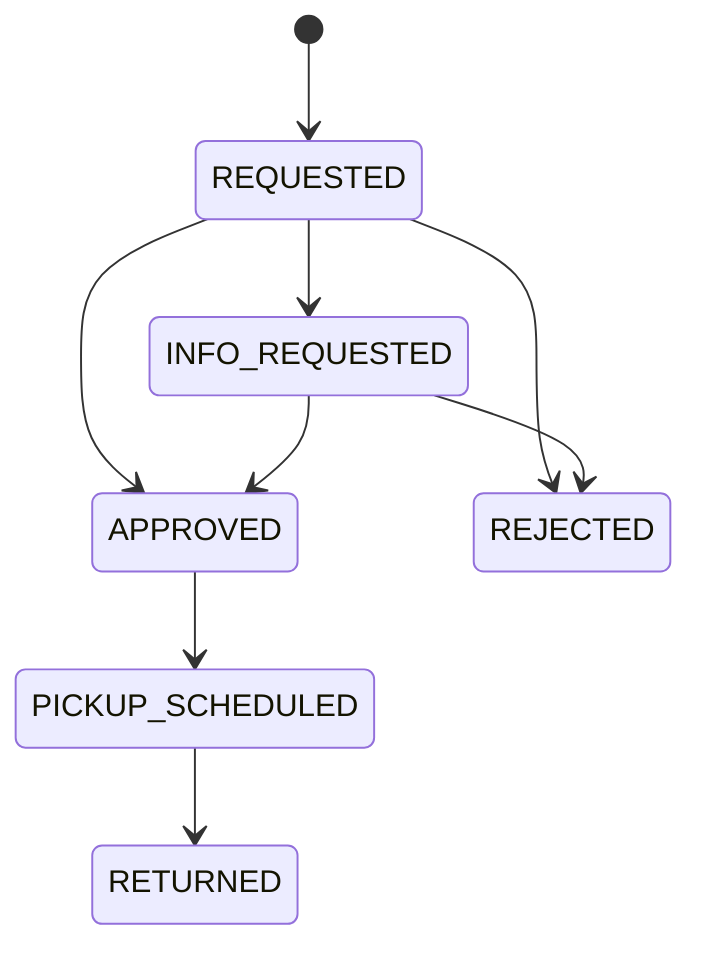

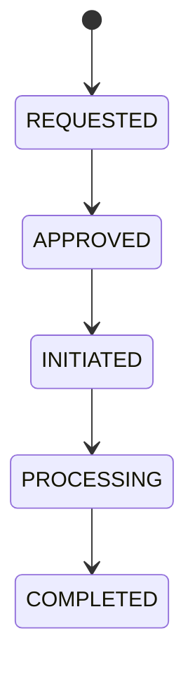

Refund amount can never exceed the eligible amount (spec §56.14) — enforced
at the service layer in a later phase, since it depends on order-item-level
proration, not a simple column check.

## 12. Tracking Lifecycle

Customer-facing `/track-order` (Phase 9) looks up an order by order number

- registered mobile/email and renders the same status timeline as the order
  lifecycle above (Order Placed → Payment Confirmed → Order Confirmed →
  Processing → Packed → Shipped → Out for Delivery → Delivered), sourced from
  `order_status_history` plus `shipments.courier_name` /
  `shipments.tracking_number`.

## 13. Vercel Deployment Architecture

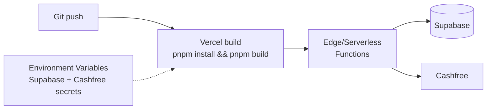

The project must build cleanly with `pnpm build` and have no local-only
dependencies (spec §54). Secrets live in Vercel environment variables, never
committed — see `.env.example`.

## 14. UI Design System

Design tokens are implemented as real Tailwind v4 `@theme` values in
[`src/app/globals.css`](../src/app/globals.css) — not just documentation.
shadcn/ui's semantic tokens (`background`, `foreground`, `primary`, etc.)
are overridden with the palette below; additional `--color-brand-*` tokens
expose the secondary fashion accents as Tailwind utilities (e.g.
`bg-brand-emerald`). Radius is kept modest (`0.375rem`) per spec §57's
warning against "excessive rounded" UI.

## 15. Color System

| Token                   | Hex       | Usage                                   |
| ----------------------- | --------- | --------------------------------------- |
| Background              | `#FFFFFF` | Page background                         |
| Primary Text            | `#171717` | Body/heading text                       |
| Secondary Text          | `#666666` | Metadata, muted text                    |
| Border                  | `#EAEAEA` | Dividers, card borders                  |
| Soft Background         | `#F7F7F5` | Section backgrounds, secondary surfaces |
| Brand Accent (Burgundy) | `#7A1830` | Primary CTA, links, focus ring          |

Secondary fashion accents (curated defaults — not specified as exact hex
values in the spec, adjust once real brand assets exist), used **sparingly**
on banners/badges/promo sections only:

| Name           | Hex       |
| -------------- | --------- |
| Rose           | `#B76E79` |
| Dusty Pink     | `#D8A7B1` |
| Emerald        | `#0B6E4F` |
| Mustard        | `#C9A227` |
| Terracotta     | `#B5502D` |
| Plum           | `#5B2A5E` |
| Champagne Gold | `#C9A66B` |

## 16. Typography System

- **Manrope** — UI/body text (`font-sans`), via `next/font/google`.
- **Fraunces** — sparing elegant serif for editorial headings (`font-serif`
  / `font-heading`), used on hero and section headings only.
- Two families max, per spec §5.
- Editorial scale: `--text-hero` (clamps 2.25rem → 3.75rem),
  `--text-section` (clamps 1.5rem → 2.25rem), plus `--text-price` and
  `--text-meta` for consistent product-card typography in later phases.

## 17. Responsive Strategy

- Mobile-first Tailwind breakpoints.
- Product grids: 4 columns desktop, 3 tablet, 2 mobile (spec §10).
- Mobile header: hamburger + logo + search + wishlist + cart (spec §6).
- Mobile shop page: sticky filter/sort controls, filter drawer instead of a
  sidebar (spec §17, §46).
- Mobile experiences are designed intentionally per breakpoint in later
  phases, not simply shrunk from desktop (spec §46).

## 18. Homepage + Navigation (implemented in Phase 3)

- `src/components/store/header.tsx` — announcement bar (rotating messages,
  `announcement-bar.tsx`) that scrolls away, then a `sticky top-0` main row
  (logo, desktop nav from `nav-links.ts`, search/wishlist/account/cart
  icons). Account icon is auth-aware via `getCurrentUser()`. Mobile uses a
  full-screen drawer (`mobile-nav.tsx`) behind a hamburger button.
- `src/components/store/footer.tsx` — multi-column footer (Shop, Customer
  Care, Policies, Follow Us, contact, payment methods) per spec §51.
- Both are wired into `src/app/(store)/layout.tsx`, so every route in that
  group (home, auth pages, and future shop/cart/account pages) shares them.
- Homepage sections (`src/app/(store)/page.tsx` composing
  `src/components/store/home/*`): hero banner, Shop by Category, Trending
  Now (horizontal scroll), 5 editorial banners (Silk/Wedding/Festive/
  Handloom/Everyday Elegance edits), New Arrivals + Best Sellers grids, and
  an Offers section — matching spec §7–§13.
- **No real product/category photography exists yet.** Every image slot
  (`MediaPlaceholder`, `src/components/store/media-placeholder.tsx`) renders
  a deterministic brand-colored gradient tile instead of a photo or a
  mismatched stock image — the same seed (e.g. a product slug) always gets
  the same gradient. Swap in real photography via `product_images.url` /
  `categories.image_url` once available; no code changes needed beyond
  replacing the placeholder with an `<Image>`.
- Product data comes from `src/features/products/queries.ts`
  (`getNewArrivals`, `getBestSellers`, `getTrendingNow`,
  `getShopByCategoryTiles`) — public, RLS-governed reads via the anon
  client, not the service-role client. "Best Sellers"/"Trending" fall back
  to rating/recency ordering since there's no real order history yet.
- Demo catalog data (spec §55) is seeded via
  [`supabase/seed.sql`](../supabase/seed.sql) — 8 categories, 9 fabrics, 6
  materials, 13 patterns, 16 colors, 6 occasions, and 12 realistic demo
  sarees (no lorem ipsum, no images). Re-run it (or the equivalent
  service-role inserts) against any fresh project.
- Wishlist/cart buttons on product cards are visual-only until Phase 6;
  nav links to not-yet-built routes (`/cart`, `/account/wishlist`, product
  detail pages, etc.) 404 until their respective phases — expected during
  phased development. `/shop` and `/sarees` are real as of Phase 4 (§19).

## 19. Saree Catalog + Search + Filters (implemented in Phase 4)

- `/sarees` (`src/app/(store)/sarees/page.tsx`) is the single canonical
  catalog implementation; `/shop` is a thin redirect that preserves query
  params (spec §17 requires both routes to exist, without further
  distinguishing them). All nav/footer links to either route work.
- Filter/sort/search state lives entirely in the URL — `q`, `category`,
  `fabric`, `color`, `pattern`, `occasion` (comma-separated multi-select),
  `price`, `discount`, `availability`, `sort`, `page`. Every filter renders
  as a plain `<Link>` (`src/components/store/catalog/filter-sidebar.tsx`)
  built by `src/features/products/catalog-url.ts` — shareable/bookmarkable
  URLs, and filtering works without client JS except the Sort `<select>`
  (`catalog-sort.tsx`, the one genuinely interactive control) and the
  mobile filter drawer (`mobile-filter-drawer.tsx`, a client wrapper around
  the same server-rendered `FilterSidebar`).
- Query building (`src/features/products/catalog.ts`, `getCatalogPage`):
  - Fabric/pattern are plain `.in()` filters; Color matches primary OR
    secondary color via `.or()`; Occasion is a many-to-many join
    (`product_occasions`) resolved to product IDs first.
  - Search (`q`) matches spec §20's own "red silk" example: free-text
    ilike against name/description/SKU, **plus** resolving each word
    against fabric/color/pattern/category names and matching products by
    those IDs. Autocomplete, recent searches, and trending searches are
    explicitly deferred — out of scope for this phase.
  - Discount filter and "Biggest Discount" sort use a new
    `products.discount_percent` **generated column** (Phase 4 migration)
    rather than computing percentages per row in application code.
  - Availability filter/badges route through a new SECURITY DEFINER RPC,
    `get_product_availability(uuid[])`, rather than selecting from
    `inventory` directly (still admin-only per Phase 2's RLS). Because
    availability isn't a filterable column on `products`, that filter uses
    a capped candidate-fetch-then-JS-filter approach instead of DB-level
    pagination — documented as a scale caveat in the code, fine at this
    catalog's size.
- `docs/database-schema.md` and the Phase 1 migration file predate
  `discount_percent` and `get_product_availability` — see
  `supabase/migrations/20260810140000_phase4_catalog.sql` for both.

## 20. Cart + Wishlist (implemented in Phase 6, ahead of Phase 5)

Built directly on the `ProductCard`s already live on the homepage/catalog
(Quick Add, wishlist heart) — Phase 5's product detail pages don't exist
yet, but cart/wishlist don't depend on them.

- **Guest carts are real carts**, not deferred to login. `carts` has both
  `user_id` (unique, logged-in) and `session_id` (guest) — Phase 2's RLS
  only covers `user_id = auth.uid()`, so guest cart reads/writes go
  through the service-role client instead, keyed by an httpOnly
  `mmgm_cart_session` cookie
  (`src/features/cart/cart-session.ts`). Splits into
  `getCartContext()` (read-only, Server Component safe, never writes a
  cookie — Next.js forbids that outside a Server Action) and
  `getOrCreateCartContext()` (Server Action only, creates the cart/cookie
  on first add).
  - Known gap: no guest→user cart merge on login yet — a guest who adds
    items then logs in gets a fresh, empty user cart. Worth fixing before
    Phase 7 (Checkout) if guest checkout is expected to convert accounts
    mid-flow.
- **Cart totals are always computed from the live `products` row**, never
  `cart_items.unit_price_snapshot` (spec §56.3) — the snapshot exists only
  as a future "price changed since you added this" reference, unused so
  far. Discount/shipping/tax are Phase 7's concern; the cart page shows
  subtotal only.
- **Stock enforcement** (spec §56.1/§56.2): `addToCartAction` /
  `updateCartItemQuantityAction` read `inventory` through the service-role
  client (still admin-only for direct browser reads) and clamp the
  requested quantity to what's actually available, returning a message
  rather than silently failing.
- **Cross-cart-item ownership check**: because guest mutations use the
  service-role client (bypasses RLS), `updateCartItemQuantityAction` /
  `removeCartItemAction` verify the target `cart_items` row actually
  belongs to the caller's own resolved `cartId` before touching it —
  otherwise nothing would stop one guest session from mutating another's
  cart item by guessing/observing an ID. Redundant-but-harmless for
  logged-in carts, where RLS already enforces the same thing.
- **Wishlist requires an account** (spec §24 lives under
  `/account/wishlist`) — `toggleWishlistAction` returns
  `{ requiresLogin: true }` for signed-out callers, and the client-side
  `WishlistButton` redirects to `/login` on that response. No-duplicates
  (spec §56.10) is enforced by the DB's unique `(wishlist_id, product_id)`
  constraint, not just application logic.
- **Wishlist heart state on listing pages is not prefetched** — checking
  per-product membership on every card across the homepage/catalog would
  mean an extra query per card, everywhere. `WishlistButton` starts
  unfilled and reflects the real state once toggled; `/account/wishlist`
  itself is always accurate since it's the source of truth.
- Server Actions call `revalidatePath("/", "layout")` after any
  cart/wishlist mutation so the Header's cart-count badge
  (`getCartItemCount()`) and the /cart, /account/wishlist pages themselves
  stay in sync — no client-side refetching needed.

## 21. Product Details (implemented in Phase 5, after Phase 6)

`/sarees/[slug]` (`src/app/(store)/sarees/[slug]/page.tsx`), built after
cart/wishlist since neither depends on it, and product cards already
linked here throughout Phases 3/4/6.

- `src/features/products/detail.ts` — `getProductDetail(slug)` resolves
  every FK (category, fabric, material, primary/secondary color, pattern,
  occasions) to display names via the same lookup-query pattern as
  elsewhere (no embedded selects); `getSimilarProducts` (same category,
  falling back to same fabric); `getProductReviews` (approved only).
- **Gallery**: no real photography exists yet, so `ProductGallery` falls
  back to a single `MediaPlaceholder` with no thumbnail strip — showing
  several identical placeholder "photos" would be dishonest. The real
  multi-image/thumbnail/hover-swap experience (spec §15) activates
  automatically once `product_images` rows exist; `next.config.ts` now
  pre-allows `**.supabase.co` in `images.remotePatterns` so that doesn't
  silently break when it happens.
- **Reviews show no reviewer name** — RLS only lets a customer read their
  own `users` row, not other reviewers', and there's no public-safe
  display name to join against. Shows a "Verified Buyer" badge instead
  (every review is a verified purchase by definition, spec §56.16). No
  review submission form yet either — that needs a real `order_item_id`
  from a completed order, which doesn't exist until Phase 7+9.
- **Delivery pincode check** (`delivery-actions.ts`) validates format and
  returns a generic estimate — there's no courier/serviceability
  integration anywhere in this project's phases. Not a stand-in for real
  order tracking (spec §30), which comes from admin-entered shipment data.
- **Recently Viewed** is pure client-side (`localStorage`, no
  `recently_viewed` table in the schema) — reads/writes a capped list on
  mount, no server round trip. Prices shown are a snapshot from when each
  product was last viewed, not live.
- `ProductCarousel` (used for New Arrivals's sibling "Trending Now" on the
  homepage) moved from `components/store/home/` to `components/store/`
  now that Similar Sarees reuses it too.
- Buy Now adds to cart then redirects straight to `/checkout` (updated once
  Phase 7 shipped it).

## 22. Checkout (implemented in Phase 7)

`/checkout` (`src/app/(store)/checkout/page.tsx`) → `placeOrderAction`
creates a real `PENDING_PAYMENT` order; `/checkout/confirmation/[orderId]`
displays it. No Cashfree integration yet (Phase 8) — the "Payment" step is
a "Place Order" button that records the order and leaves the `payments`
row `PENDING` rather than faking a successful charge (spec §61 forbids
fake payment success).

- **Guest checkout required a schema fix.** Phase 1 made `orders.user_id`
  and `addresses.user_id` `NOT NULL`, which silently blocks the guest
  checkout spec §27 step 1 explicitly calls for — and Phase 6 already
  built guest cart support anticipating it. Migration
  `20260810150000_phase7_guest_checkout.sql` (**must be run in the
  Supabase SQL Editor**, same as every prior DDL change) makes both
  nullable, adds `orders.guest_email`/`guest_phone` with a
  `chk_orders_user_or_guest` check, and makes `coupon_usage.user_id`
  nullable so a guest order still counts against a coupon's global
  `usage_limit` (just not `per_user_limit`, which is skipped for guests —
  there's no account to track it against).
- **All writes go through the service-role client**
  (`src/features/checkout/actions.ts`), consistent with the RLS design
  from Phase 2: `orders`/`order_items`/`payments`/`coupon_usage` have no
  client-insert policy at all, by design — every total is server-computed,
  never trusted from the client (spec §56.3).
- **Order confirmation is read via an unguessable order ID, not RLS.** A
  guest order has no `auth.uid()` for the existing "Users view own
  orders" policy to match, so `getOrderConfirmation` reads with the
  service-role client, and the order's UUID in the URL is the access
  token — the same pattern most checkout confirmation pages use
  (generated once, never listed, effectively unguessable). Logged-in
  users' own order history is a `/account` page for a later phase, scoped
  by RLS as normal.
- **Pricing** (`src/features/checkout/pricing.ts`): free shipping ≥ ₹999
  (matches the sitewide announcement-bar copy from Phase 3), else a flat
  ₹99 shipping fee; GST modelled as a flat 5% rather than India's real
  HSN-slab textile schedule (5%/12% by unit price) — an intentional
  simplification, not an attempt at a tax engine.
- **Coupons** (`src/features/checkout/coupon.ts`): validates code, active
  flag, date window, `min_order_amount`, `usage_limit`, and
  `per_user_limit` server-side, re-checked again at final order placement
  (never trusts the client-side "Apply" preview). Per-product/category
  coupon scoping (`coupon_products`/`coupon_categories`, tables exist but
  unused) and the admin coupon management UI are Phase 12's job — every
  coupon here applies storewide. One demo coupon is seeded: `WELCOME10`
  (10% off, min ₹999, capped at ₹500).
- **Inventory is not touched at order creation.** `getCartSummary`'s
  availability check (boolean, from the Phase 4 RPC) blocks checkout if
  any line is out of stock, but `inventory.quantity`/`reserved_quantity`
  aren't decremented or reserved here — that happens on payment
  confirmation once Phase 8 wires up the Cashfree webhook. Reserving
  stock on every `PENDING_PAYMENT` order with no expiry/release mechanism
  would lock inventory indefinitely for orders that never pay; deferring
  to payment success is the standard pattern.
- Address forms don't yet offer a saved-address picker (`/account`
  addresses book UI doesn't exist) — every checkout collects a fresh
  address, saved as an orphaned `addresses` row (`user_id` set for
  logged-in users, but not linked into any "my addresses" list yet).
